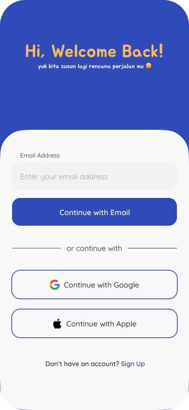
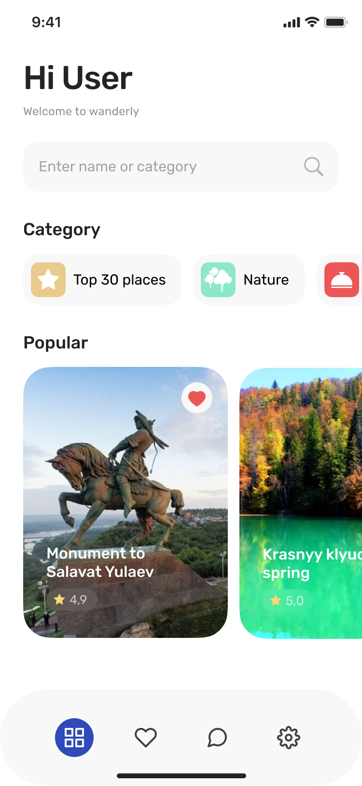
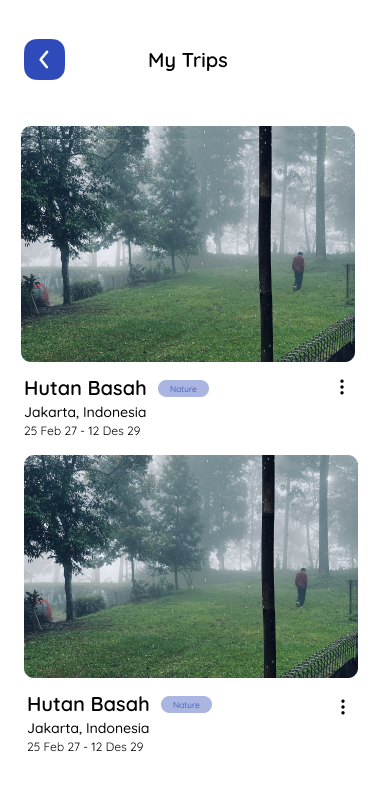

# 🌍 Wanderly App

> Aplikasi mobile untuk merencanakan, menyimpan, dan berbagi petualangan perjalanan Anda dengan mudah.

Wanderly adalah aplikasi travel planning yang dirancang untuk membantu Anda mengorganisir setiap detail perjalanan impian Anda. Dari perencanaan awal hingga dokumentasi perjalanan, semua ada di satu tempat.

---

## 📱 Screenshots

| Onboarding | Sign In | Home | Saved Trips |
|:---:|:---:|:---:|:---:|
|  |  |  |  |

---

## ✨ Fitur Utama

### 🎯 Fitur Inti
- **Onboarding Interaktif** - Pengenalan aplikasi yang menarik untuk pengguna baru
- **Autentikasi Pengguna** - Sign In dan Sign Up dengan form validation
- **Dashboard Home** - Tampilan utama dengan rekomendasi dan quick access
- **Simpan Perjalanan** - Menyimpan rencana perjalanan favorit Anda
- **Manajemen Trip** - Kelola semua perjalanan Anda dalam satu tempat

### 🎨 User Experience
- **Desain Modern** - Interface yang clean dan user-friendly
- **Responsive Layout** - Adaptif di berbagai ukuran layar
- **Navigasi Intuitif** - Mudah berpindah antar halaman
- **Custom Icons** - Ikon yang colorful dan menarik

---

## 🛠️ Teknologi & Dependencies

### Framework & Platform
- **Flutter** - Framework UI modern untuk mobile development
- **Dart** - Bahasa pemrograman yang powerful dan efficient

### UI & Design
- **Material Design** - Design system yang konsisten dan modern
- **Google Fonts** - Typography yang elegan dengan berbagai pilihan font
- **Iconify Flutter** - Icon library yang comprehensive
- **Colorful Iconify Flutter** - Icon dengan warna-warna yang vibrant
- **Sizer** - Responsive sizing untuk berbagai ukuran device

### Development
- **Flutter Lints** - Code quality dan best practices

---

## 🚀 Cara Memulai

### Prerequisites
- Flutter SDK (v3.10.7 atau lebih tinggi)
- Dart SDK
- Android Studio / Xcode (untuk emulator)

### Instalasi

1. **Clone Repository**
   ```bash
   git clone <repository-url>
   cd wanderly_app
   ```

2. **Install Dependencies**
   ```bash
   flutter pub get
   ```

3. **Run Aplikasi**
   ```bash
   flutter run
   ```

### Build APK (Android)
```bash
flutter build apk --release
```

### Build IPA (iOS)
```bash
flutter build ios --release
```

---

## 📁 Struktur Project

```
wanderly_app/
├── lib/
│   ├── main.dart                 # Entry point aplikasi
│   ├── screens/                  # Semua halaman aplikasi
│   │   ├── onbboarding_screen.dart
│   │   ├── auth/                 # Authentication screens
│   │   │   ├── signin_screen.dart
│   │   │   ├── signin_form_screen.dart
│   │   │   ├── signup_screen.dart
│   │   │   └── signup_form_screen.dart
│   │   ├── home_screen.dart
│   │   └── saved_trip_screen.dart
│   ├── widgets/                  # Reusable UI components
│   │   └── mytrip_card.dart
│   ├── theme/                    # Theme & styling
│   └── _mock/                    # Mock data untuk development
│       └── mytrips.dart
├── assets/
│   ├── images/                   # Image assets
│   └── important/                # Important resources
├── android/                      # Android native code
├── ios/                          # iOS native code
├── pubspec.yaml                  # Dependencies & project config
└── README.md                     # Dokumentasi project
```

---

## 🎯 Roadmap Fitur

- [ ] Integrasi dengan Google Maps API
- [ ] Fitur sharing perjalanan dengan teman
- [ ] Notifikasi reminder untuk perjalanan
- [ ] Offline mode untuk akses data tanpa internet
- [ ] Export perjalanan ke PDF
- [ ] Social media integration
- [ ] Budget tracking untuk perjalanan
- [ ] Weather forecast integration

---

## 📝 Catatan Pengembangan

### Routing
Aplikasi menggunakan named routes untuk navigasi yang lebih terstruktur:
- `Onbboarding.routName` - Halaman onboarding
- `SigninScreen.routeName` - Halaman sign in
- `SigninFormScreen.routeName` - Form sign in
- `HomeScreen.routeName` - Halaman utama
- `SignupScreen.routeName` - Halaman sign up
- `SignupFormScreen.routeName` - Form sign up
- `SavedTripScreen.routName` - Halaman perjalanan tersimpan

### Responsive Design
Menggunakan package `sizer` untuk membuat layout yang responsive di berbagai ukuran device.

---

## 🤝 Kontribusi

Kami menerima kontribusi dari siapa saja! Silakan:

1. Fork repository ini
2. Buat branch fitur (`git checkout -b feature/AmazingFeature`)
3. Commit perubahan (`git commit -m 'Add some AmazingFeature'`)
4. Push ke branch (`git push origin feature/AmazingFeature`)
5. Buat Pull Request

## 📞 Kontak & Support

Jika Anda memiliki pertanyaan atau saran, silakan buat issue di repository ini atau hubungi tim development.

---

**Happy Traveling! 🌏✈️**
